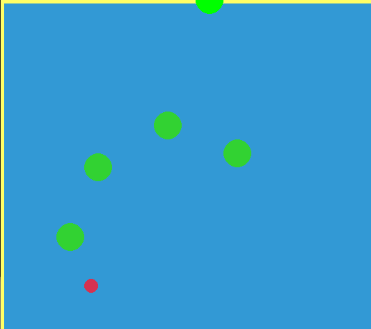
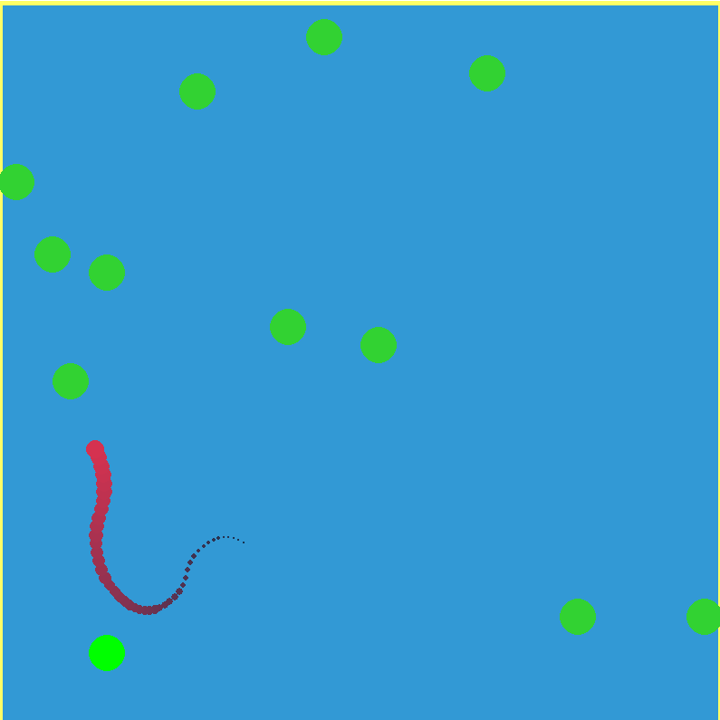
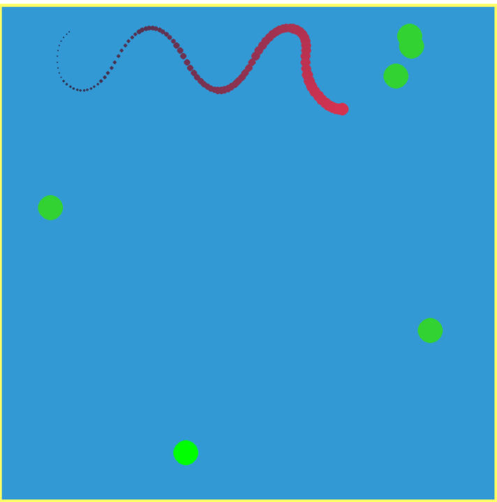

# Dot Cleaner Mini Projects

The following mini projects centre on using Python and Pygame to simulate a red dot travelling to and cleaning up green dots on the screen.

## Dot Cleaner simple

The simple version of Dot Cleaner has a player-controlled green circle that can move around and place green dots on the screen, and a red dot that automatically chooses the nearest green dot and moves to it to clean it up.

## Dot Cleaner Thruster

The thruster version of Dot Cleaner has the red dot move around using a thruster, rather than direct movement. Gravity pulls it down the screen, and it uses vertical and lateral acceleration to move to the green dots.
It also now features a tail.

## Dot Cleaner Thruster Plus

The thruster plus version of Dot Cleaner operates similarly to Snake. The red dot still moves via a thruster, but it now builds a tail as it collects green dots. The player can still manually place green dots, but the game will automatically place green dots periodically.

