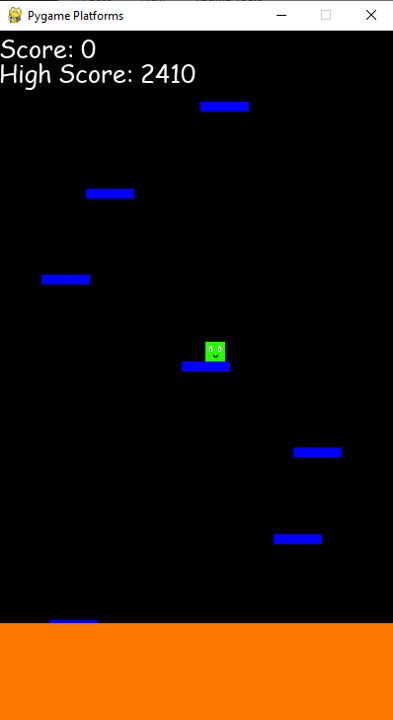

# Lava Jumper platform game

This is a Python script using pygame. The object of the game is to jump from one platform to the next while avoiding the rising lava.

Points are scored for each platform, and boosts and parachutes can be collected to aid your efforts.
The score and high score are recorded and displayed.

